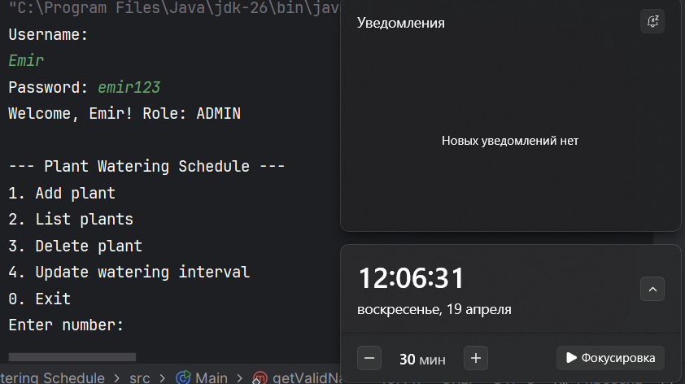
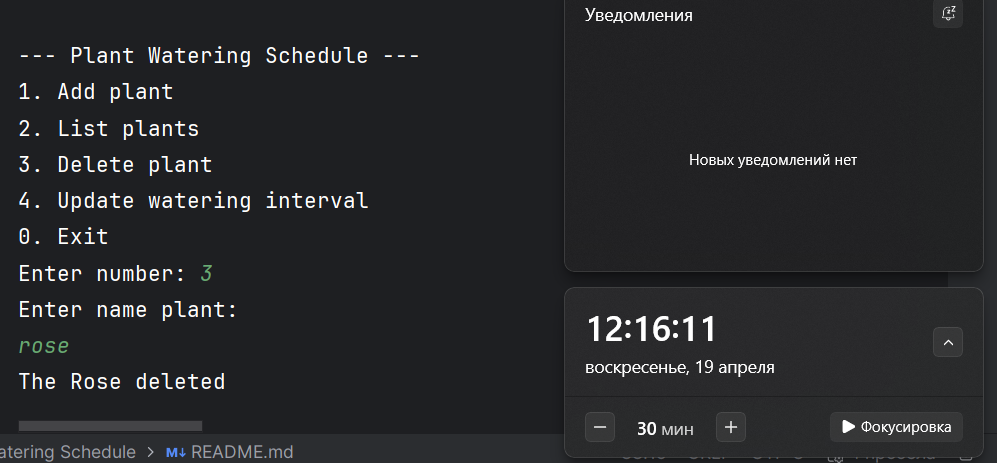
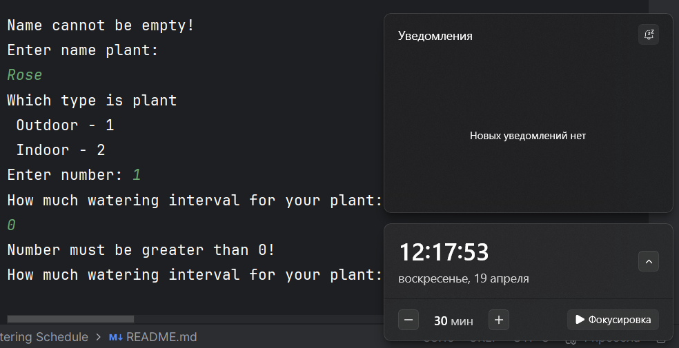

# Plant Watering Schedule

## Description
A console-based application for managing plant watering schedules.
Users can track their plants, set watering intervals, and get reminders.

## Student
Name: Emir

## How to Run
1. Clone the repository
2. Open in IntelliJ IDEA
3. Run `Main.java`
4. Login with:
    - Admin: username `Emir`, password `emir123`
    - User: username `user`, password `user123`

## Project Requirements
1. CRUD operations for plants
2. Command Line Interface with menus
3. Input validation (empty fields, invalid numbers, letters only for names)
4. Data persistence using CSV file
5. Modular design (model, manager packages)
6. Documentation in README
7. Error handling with try/catch
8. Encapsulation (private fields, getters/setters)
9. Inheritance (Plant → IndoorPlant, OutdoorPlant)
10. Polymorphism (getInfo() method)

## Bonus Features
- Authentication system with roles (ADMIN, USER)

## Screenshots
### Login and Main Menu

### Add Plant

### List Plants

### Update Plant

### Delete Plant

### Validation
